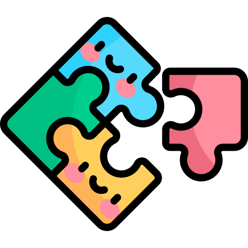

# This is a website that contains few basic games

 Open it on desktop as it is not responsive!! 

&nbsp;&nbsp;&nbsp;&nbsp;&nbsp;

# This is live -
You can check it here : "https://playgame-getd.onrender.com/"
 

1. Tic-Tac-Toe
2. 2048 game
3. Suggest some more easy games to add!!!!

# Build with - 🛠️
##&nbsp;FRONTEND - 

&ensp;Reactjs &ensp;| &ensp;
&ensp;Javascript  &ensp;| &ensp;
&ensp;HTML  &ensp;| &ensp;
&ensp;CSS

##&nbsp;EMAIL SERVICE - 

&ensp;Emailjs

# THANK YOU 👋

